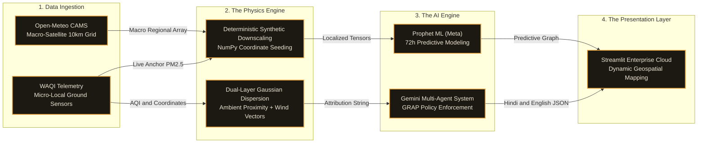

# 🌬️ VayuTrace AI

**Enterprise atmospheric intelligence, spatial source attribution, and multi-agent emergency response.**

Passive environmental dashboards only tell you what the air quality is. VayuTrace AI is an active geospatial engine built for city administrators to determine *why* the air is toxic, *where* it is coming from, and *how* to deploy immediate public health interventions.


---

## 🚀 The Architecture

VayuTrace is built on a single-source-of-truth data-fusion pipeline, keeping satellite physics and LLM generation synchronized against one shared atmospheric state.

1. **The Telemetry Layer** — Fuses ground-sensor pollution data (WAQI) with live meteorological satellite feeds (Open-Meteo). Includes automatic fallback: if a live wind reading fails, the system degrades to a cached macro-vector instead of crashing.
2. **The Physics Layer (Gaussian Dispersion)** — Maps live wind vectors and calculates downwind dispersion plumes from known industrial zones using Pasquill–Gifford Gaussian plume mathematics (Stability Class D).
3. **The Intelligence Layer (Multi-Agent LLM)** — Routes the unified atmospheric state (AQI, wind speed, heading, rain-washout status) into Google Gemini 2.5 Flash, generating sequential, GRAP-compliant advisories grounded in Delhi CAQM's official Graded Response Action Plan.

---

## ⚡ Core Features

- **Real-Time Spatial Attribution** — Replaces manual source-guessing with geometric vector math. If a highly polluted monitoring station falls inside the calculated wind cone of a known industrial site, the map dynamically flags the likely source and dispersion pathway.
- **Multi-Agent Intervention Protocol** — A 3-node sequential response, not a generic chatbot:
  - `[NODE 01] Analyst` — assesses physical severity from live AQI and meteorological context.
  - `[NODE 02] Enforcement` — generates tactical deployment orders aligned to the active GRAP stage.
  - `[NODE 03] Broadcast` — translates the enforcement directive into professional Hindi for public release.
- **Predictive Forecasting** — Uses historical Copernicus (CAMS) atmospheric data to project PM2.5 concentrations up to 72 hours ahead, with backtested error validation (MAE / RMSE) shown alongside the forecast.
- **Tactical UI/UX** — A custom dark instrument-panel interface built to keep chemical severity (AQI color scale) and physics vectors (wind/dispersion overlays) visually distinct at a glance.

---

## 🛠️ Stack & Deployment

**Core stack:** Python · Streamlit · Prophet · Folium · Pandas · Google Gemini API · Open-Meteo API · WAQI API

### Local Installation

VayuTrace enforces strict repository hygiene — API keys never touch version control.

**1. Clone the repository and install dependencies:**

```bash
git clone https://github.com/yourusername/vayuTrace-AI.git
cd vayuTrace-AI
pip install -r requirements.txt
```

**2. Create a `.env` file in the project root** (already covered by `.gitignore`):

```env
GEMINI_API_KEY="your_google_ai_studio_key_here"
WAQI_API_KEY="your_world_air_quality_index_key_here"
```

**3. Run the application:**

```bash
streamlit run app.py
```

### Cloud Deployment (Streamlit Community Cloud)

Link your GitHub repository to Streamlit Cloud, then go to **App Settings → Secrets** and add your credentials in TOML format:

```toml
GEMINI_API_KEY = "your_google_ai_studio_key_here"
WAQI_API_KEY = "your_world_air_quality_index_key_here"
```

The application detects the cloud environment automatically and reads credentials from Streamlit's secrets manager — no code changes required between local and deployed environments.

```

---

*Built for the evaluation of urban environmental response systems.*
